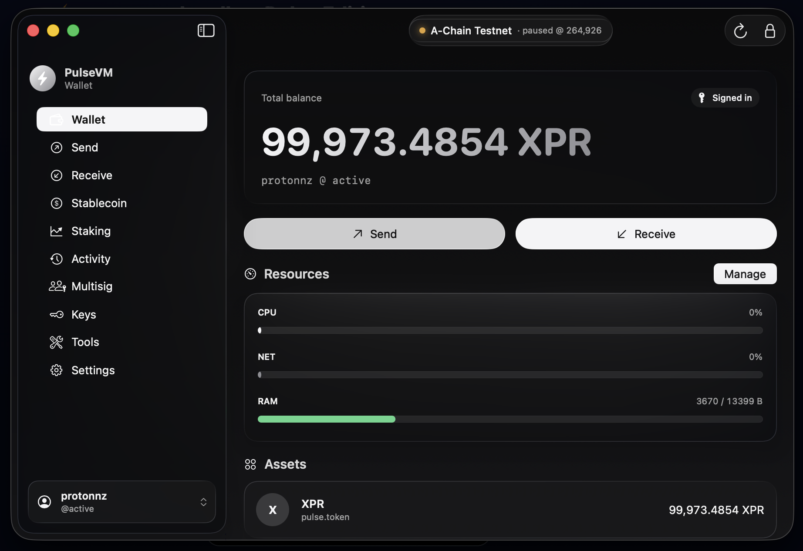

<p align="center">
  
</p>

<h1 align="center">PulseVM Wallet</h1>

<p align="center">
  The native macOS wallet for <strong>PulseVM</strong> networks (A-Chain / XPR Network) —
  hardware-backed signing, decode-before-sign, multisig, and a seamless dapp connector.
</p>

<p align="center">
  
</p>

---

## What it is

An institution-grade desktop wallet for PulseVM. Private keys are **hardware-custodied** —
generated in the Mac's **Secure Enclave** or held on a **YubiKey (PIV)** — and signatures are
produced on-device behind Touch ID. Keys never leave the hardware.

- **Hardware key custody** — Secure Enclave (R1) and YubiKey PIV (R1); imported R1/K1 keys
  are encrypted via an Enclave-wrapped vault (never the login keychain).
- **Decode-before-sign** — every dapp/transaction request is decoded and shown as real
  actions (amounts, recipients, authorizations) before you approve; nothing is signed blind.
- **Multisig** (`pulse.msig`) — propose / review-decoded / approve / execute.
- **Key & permission management** — create / import / rotate keys, `updateauth`.
- **Networks** — add/edit/select endpoints + chain id; white-label themes.
- **Dapp connector** — `pulsevm://` deep-link login + sign, with a **seamless relay**
  (no second browser tab). See the two web SDKs below.

## The differentiator

PulseVM supports **R1 (secp256r1)** keys natively — the same curve as Apple's **Secure
Enclave**, **YubiKey PIV**, and **WebAuthn passkeys**. So the wallet uses **hardware-backed,
biometric, non-exportable keys as real on-chain keys** — no seed phrase, Touch ID to sign.
secp256k1-only chains can't do this natively.

## Architecture — "core = chain logic, signer = platform"

| Layer | Tech | Role |
|-------|------|------|
| `core/` | **Rust** (`pulse-wallet-core`) | Canonical key/sig encoding (SIG_R1/SIG_K1), tx serialization + signing digest — validated byte-for-byte vs pulsevm-js. Exposed to Swift via a C ABI. |
| `apps/macos/` | **Swift / SwiftUI** (macOS 26) | UI + Secure Enclave / YubiKey signing. Built with [XcodeGen](https://github.com/yonaskolb/XcodeGen). |

**On signatures (not private keys):** PulseVM verifies a transaction by **recovering the
signer's _public_ key from the _signature_** (ECDSA public-key recovery) and matching it to the
account's permission. So each signature must carry a recovery id — which the core derives for
Secure Enclave / YubiKey ECDSA (their hardware doesn't emit one). **Private keys are never
extractable or recoverable.** If a hardware key is lost, you don't "recover" it — you rotate the
account to a new key (`updateauth`). That's PulseVM's account model: a lost key is a rotation,
not a lost account.

## Build

```bash
brew install xcodegen
scripts/build-core-macos.sh         # builds the universal Rust core → apps/macos/Vendor/
cd apps/macos && xcodegen generate
open PulseWallet.xcodeproj           # then Run, or:
./scripts/release-dmg.sh             # signed + notarized .dmg (needs your Developer ID)
```

## Web SDKs (connect a dapp)

- **[pulse-web-sdk](https://github.com/paulgnz/pulse-web-sdk)** — lightweight, zero-dependency desktop connector.
- **[proton-web-sdk-pulse](https://github.com/paulgnz/proton-web-sdk-pulse)** — fork of proton-web-sdk with the full
  wallet selector + native PulseVM Wallet (Desktop) over `pulsevm://`.

Live demos: **[pulsevm.dev/demo](https://pulsevm.dev/demo)** · **[pulsevm.dev/demo-pulse](https://pulsevm.dev/demo-pulse)**

## Security

Keys are hardware-rooted (Secure Enclave / YubiKey), biometric-gated, never stored in
plaintext, and never transmitted — only signatures are. See **[SECURITY-AUDIT.md](SECURITY-AUDIT.md)**.
Please report vulnerabilities privately to the maintainers rather than opening a public issue.

## License

[MIT](LICENSE) © Metallicus Inc.
